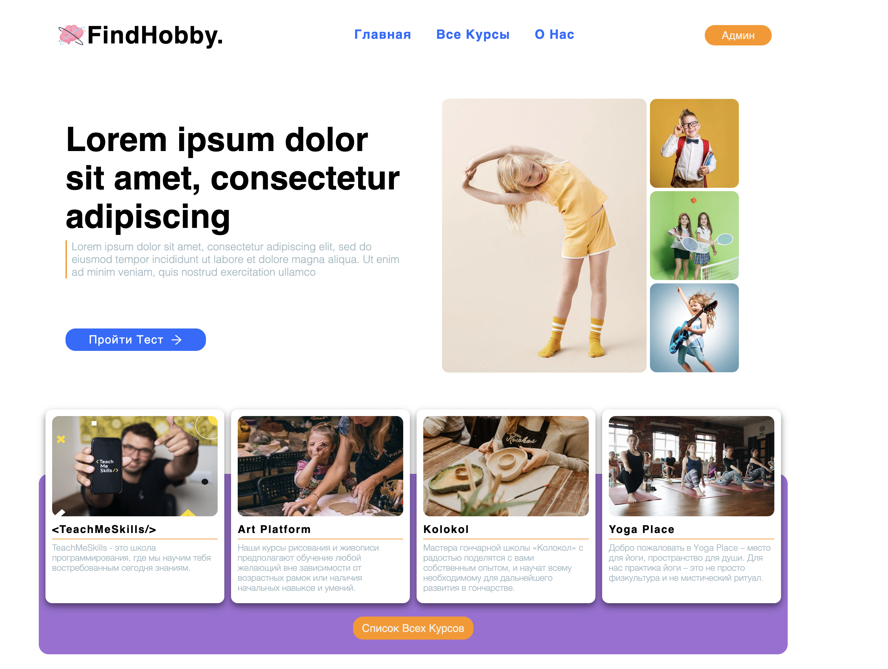
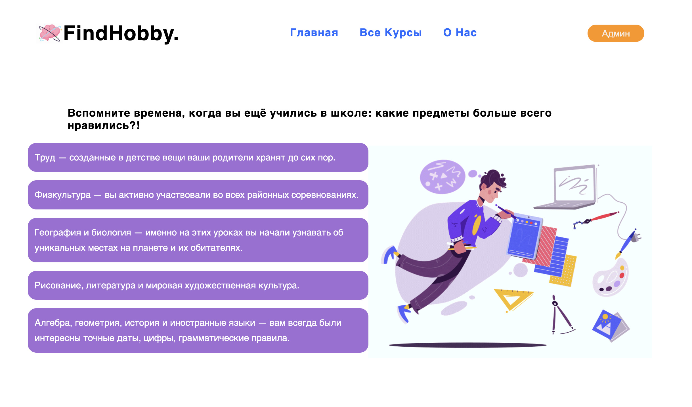

# BookStore

[Live Demo](https://aliaksandra-leanovich.github.io/hackathon-2022-front/)

## About The Project

---

 

 

The idea of the project is that based on the results of the test a person could choose a hobby for themselves. After passing the test, the user is shown a list of courses/hobbies suitable for the person (all courses were taken by us, but in the idea that managers from the courses side fill out a form with the purpose of further placement their course on our site, then manager from our side contact them).
In future: will add a page for the manager with adding, removing and editing courses, add redux.
In this repository there is only the frontend part, since the backend(Java) part was not developed by me, it is not here. Also in our team were devops, aqa(Java) and pm.

 

 
## Tools and Packages

---

- [React](https://reactjs.org/)
- [Redux Toolkit](https://redux-toolkit.js.org/)
- [Styled-Components](https://styled-components.com/)
- [React-Hook-Form](https://react-hook-form.com/)
- [React-Router-Dom](https://v5.reactrouter.com/web/guides/quick-start)
- [Axios](https://axios-http.com/docs/intro)
